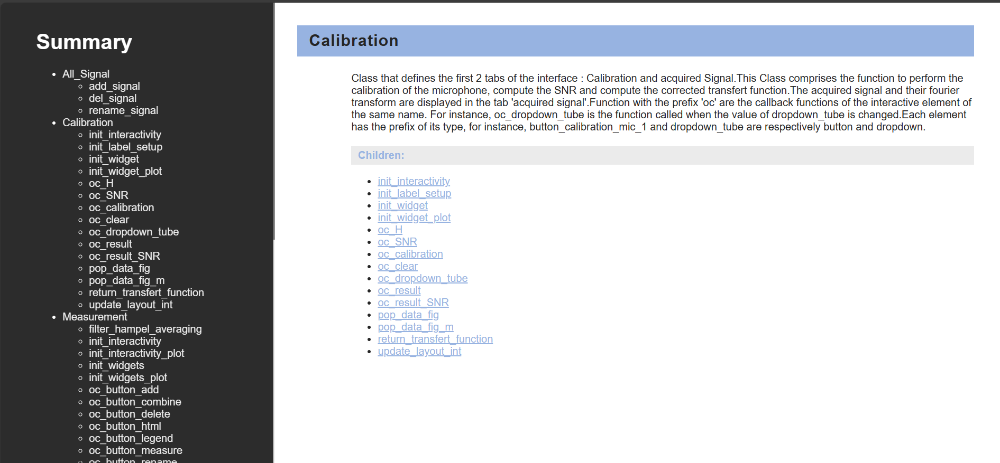
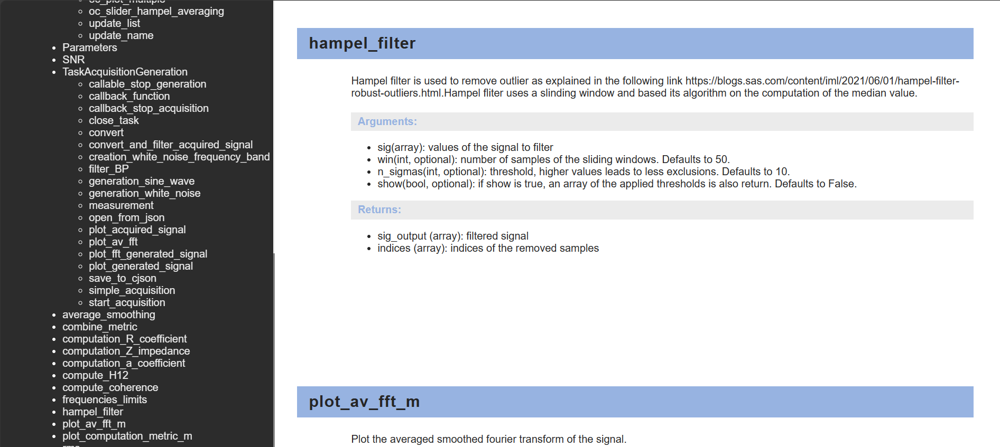

# Doc Generator
This project was created to generate an interactive html documentation from the docstring of a .py file.


## Installing Example
1. Create Docstring in your .py file with the same architecture as bellow:
```py
    def hampel_filter(sig, win= 50, n_sigmas=10,show=False):
        """Hampel filter is used to remove outlier as explained in the following link https://blogs.sas.com/content/iml/2021/06/01/hampel-filter-robust-outliers.html.
        Hampel fliter uses a slinding window and based its algorithm on the computation of the median value.
    
        Args:
            sig (array): values of the signal to filter
            win (int, optional): number of samples of the sliding windows. Defaults to 50.
            n_sigmas (int, optional): threshold, higher values leads to less exclusions. Defaults to 10.
            show (bool, optional): if show is true, an array of the applied thresholds is also return. Defaults to False.
    
        Returns:
            sig_output (array): filtered signal
            indices (array): indices of the removed samples
        """
        
        n = len(sig)
        if not isinstance(sig,np.ndarray):
            sig = np.array(sig)
        sig_output = sig.copy()
        k = 1.4826 # scale factor for Gaussian distribution
     
        
        indices = []
        
        if show:
            S0_list = np.zeros_like(sig)
    
        for i in range((win),(n - win)):
            median_win = np.median(sig[(i - win):(i + win)])
            S0 = k * np.median(np.abs(sig[(i - win):(i + win)] - median_win))
    
            if (np.abs(sig[i] - median_win) > n_sigmas * S0):
                sig_output[i] = median_win
                indices.append(i)
    
            if show:
                S0_list[(i - win):(i + win)] =  n_sigmas * S0
    
        if show:
            return sig_output, indices,S0_list
        return sig_output, indices
```

2. In the Notebook, in the import cell, replace `Tube_kundt` in ` import Tube_kundt as module` with the name of your .py file.
3. Execute the Notebook


